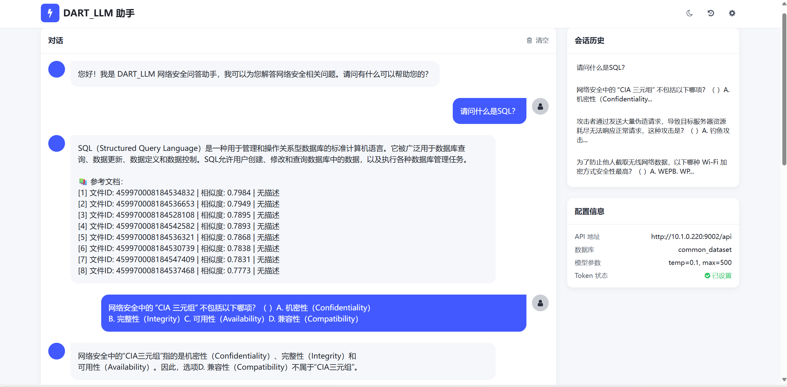

# DART_LLM
DART平台大模型安全大作业

### 大作业具体要求：

### 目录架构：

### 具体分工：
- RAG算法：刘昊雨
- 提示词工程：武文杰
- AI前端：金云韬
- 构建自主知识库：暂时放置

### 第七周进度汇报：

完成了在GUI界面，用户输入查询，然后RAG，构建完整prompt，调用后端llm给出回复并输出到界面的完整pipeline。

接下来的任务：
1.反复迭代提示词工程，结合rag内容构建更加完善的prompt，提升输出的准确性和安全性。（至少要能保证基本知识的回答没问题，通过黑盒测试）
2.尝试构建网安知识库并上传，测试是否相对于baseline有提升。

