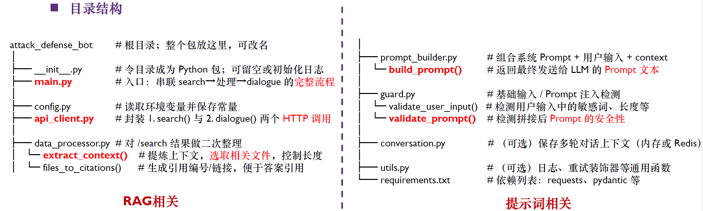
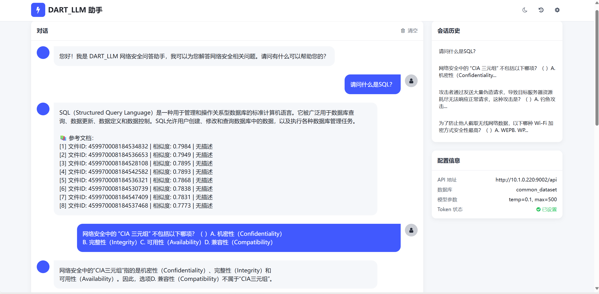

# DART_LLM
DART网络安全Agent

## 运行方式：
1. 配置项目环境（见requirements.txt）

2. 运行config.py配置项目环境

3. 开启VPN，运行main.py

4. 打开GUI.html，查看前端页面并交互

### 目录架构：

### 具体分工：
- RAG算法：刘昊雨
- 提示词工程：武文杰
- AI前端：金云韬
- 构建自主知识库：刘昊雨，已完成

### 第七周进度汇报：

完成了在GUI界面，用户输入查询，然后RAG，构建完整prompt，调用后端llm给出回复并输出到界面的完整pipeline。

- 完成自建语料库，使用基于知识图谱利用LLM生成的网安知识构建问答数据集
- 前端页面完善，支持上下文保留和markdown输出渲染，更加美观
- 安全性：对输入，prompt和输出进行分级审查，利用二次高级Agent审查，给出置信度分数。基于分数决定是否回答，可以灵活调整阈值。测试效果良好，能够有效避免过于严格导致正常问题无法回答。

